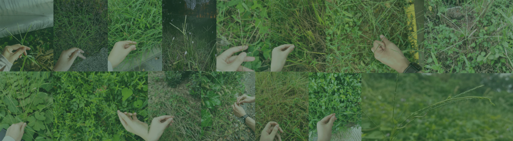

# *Digitaria* Weediness Project
Scripts used in Weediness of *Digiatria* Project

- T2T reference genome assembly
- Genome annotation
- Population structure
- Sympatric introgression
- Chloroplast assembly
- Anlysis based on assemblies

For any questions or more details, please contact at [yujiehuang@zju.edu.cn]().
